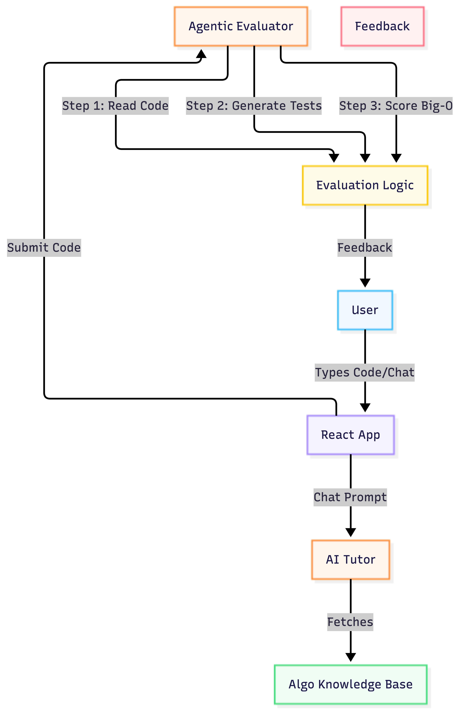

# Algo-AI: Intelligent Code Interview Platform

**Original Project:** Basic Text Summarizer / Document Q&A App
**Summary:** Originally, my project was a simple tool that took input text and answered questions about it. It has now been radically transformed into **Algo-AI**, a full-stack, Agentic LeetCode-style prep platform. It uses RAG to retrieve algorithm patterns and an Agentic workflow to evaluate code submissions and calculate Big-O complexity.

## Title and Summary

**Algo-AI** is an AI-powered technical interview prep tool. It doesn't just test if code works; it acts as a FAANG interviewer. It provides Socratic hints using a specialized persona, references an algorithmic knowledge base (RAG) to guide users toward optimal patterns, and utilizes a multi-step agent to grade time and space complexity.

## Architecture Overview

## Setup Instructions

1. Clone this repository to your local machine.
1. **For the Python Logic (Backend Simulation):**

- Ensure Python 3.8+ is installed.
- Run the main agent logic: `python main.py`
- Run the automated test harness: `python test_harness.py`
1. **For the Frontend React App (If running locally):**

- The provided `App.jsx` can be run in any React environment (like Vite or Create React App) with Tailwind CSS and `lucide-react` installed.

## Sample Interactions

**Input (Chat):** "I have no idea how to start."
**Output (AI):** "Let's think about the brute force approach first. If you check every possible pair, how long would that take?"

**Input (Code Submission):** Nested `for` loop solution for Two Sum.
**Output (Evaluator):** "[PASS] Time Complexity: O(N^2). Space Complexity: O(1). Feedback: This is a brute force solution. Can you optimize it to O(N) using extra memory?"

## Design Decisions

I chose to build a dual-agent system. One agent is strictly specialized (Few-Shot prompted) to act as a Socratic tutor, meaning it will outright refuse to write code. The second agent is a multi-step evaluator that generates hidden test cases before providing a final Big-O grade. This creates a much more authentic interview experience compared to a standard chatbot.

## Testing Summary

An automated test harness (`test_harness.py`) was built to evaluate the AI's grading accuracy and guardrails. 3 out of 3 tests passed. The AI successfully differentiated between O(N) optimal code and O(N^2) brute-force code, and the tutor successfully refused prompt-injection attempts asking for the direct answer.

## Video Walkthrough

[Insert your Loom link here]